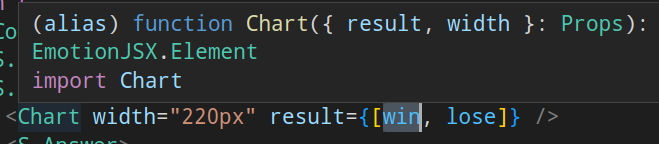
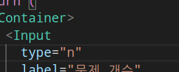
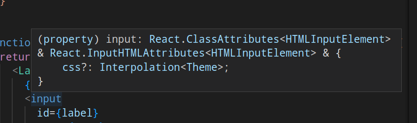
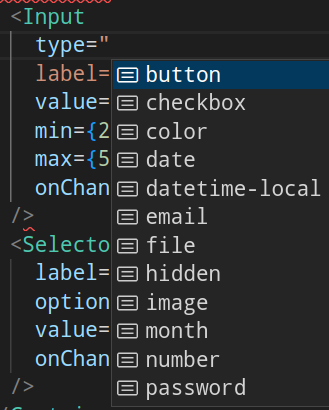

- 페이지 라우팅
	- QuizView와 ResultView 는 하나의 quiz 라는 루트로 되어 있는데. 하나의 url 루트에서 삼항연산자로 처리되어서 위화감이 있음.
	- 각 문제 step마다 별개의 route가 있어야 할듯.
	- 문제를 풀던 중에 뒤로가기를 누르면, 난이도 선택 메뉴로 돌아가서 위화감이 있음
	- 그래도 전역 상태에 풀이 기록이 남아 있어서, 풀던 곳부터 다시 시작할 수 있는 점은 좋은듯
- 상태 관리
	- SWR을 사용한 이유?
		- 예를 들어...
		- 페이지 최상단에서 fetcher로만 사용하고 있어서, useEffect를 쓰는 것과 차이를 모르겠음.
		- useSWR이나 useQuery 같은 라이브러리에 컴포넌트가 직접 의존하는데. 한 번 커스텀 훅으로 감싸는 게 좋을듯?
			- 예를 들어 count와 difficulty를 매개변수로 받는 훅이 되어야 할 것.
	- 대부분의 로직을 setter로 노출하고 있는데...
		- 상태 로직이 변하면 유지보수하기 어려울 것 같음.
		- 보일러 플레이트가 많아짐
		- 각 컴포넌트에서 너무 많은 메서드를 가져오게 됨
		- 예를 들어 handleRestart나 handleReadMode 등은 상태 라이브러리에 메서드로 구현해서 공개하면 좋을듯
	- useQuizStore에 상태도 너무 많고, 서로 무관한 것도 섞여 있음
		- isReadMode와 startTime, endTime, page는 같이 변하지만 (Quiz 페이지에서 사용)
		- count와 difficulty, quizzes는 하나의 세트 (option 페이지에서 사용)
		- 분리하는 게 좋을듯!
		- count와 difficulty는 query string에 들어 있어야 할 듯?
	- filter는 store에 들어가야 할 데이터 전처리 로직이지 범용적인 utils는 아닌듯.
		- 데이터를 전처리한다면 correct_answer나 selected_answer도 카멜 케이스(corretAnsewr)로 처리해주면 좋았을듯.
		- selected_answer는 서버에서 가져온 데이터가 아닌데. 이를 수정하기 위해 quizzes 전체를 불변으로 수정하는 것은, immer를 쓰더라도 안티 패턴임.
	- selector가 없이 quizzes 전체를 가져오고 있어서. quizzes 전체에 리렌더링이 일어나게 됨.
		- 물론 한 번에 하나의 quiz만 보여주고. quiz의 개수도 많지 않아서, 성능 상의 문제는 크지 않지만. 무한 스크롤 같은 리스트였으면 성능 하락이 심각했을 것...
		- 다음 로직은 quizzes[page]로 가져오기 보다는 전용 selector나 getter를 만들면 좋았을듯.
			- ```tsx
			  // before
			  const currentQuiz = quizzes[page];
			  const answer = quizzes[page].correct_answer;
			  const selected = quizzes[page].selected_answer;
			  //...
			  <S.Question aria-label="퀴즈 문제">{currentQuiz.question}</S.Question>
			  	<ul>
			    		{currentQuiz.choices.map((choice, idx) => (
			  
			  // after
			  const { question, choices, answer, selected } = getQuiz(page)
			  <S.Question aria-label="퀴즈 문제">{question}</S.Question>
			  	<ul>
			    		{choices.map((choice, idx) => (
			  ```
- test
	- 테스트를 나중에 추가했는데, 테스트로 어떤 이점이 있었는지?
	- 예를 들어...
		- 회귀 테스트는 리팩토링에 도움이 되는데. 테스트 후에 리팩토링을 한 커밋 로그가 없음
		- 핵심 로직보다는, 화면에 무엇을 보여주는지 정도만 테스트하고 있는데. 들인 노력에 비해 효과는 크지 않은듯.
	- aria-label은 textContent를 대체하는데. 텍스트가 있는 경우에는 aria-labelledBy를 사용해야 함
		- aria-label이 있으면 스크린 리더는 퀴즈 문제 내용을 무시하게 됨. 내용은 읽어주지 않고 "퀴즈 문제"라는 라벨만 읽어서. 시각 장애인은 앱을 전혀 사용할 수가 없음.
	- getBy는 스크린에 요소가 없으면 error를 던지기 때문에, toBeInTheDocument로 확인하는 건 불필요함. 보통은 기존에 있었던 요소가, dom에서 사라졌는지 확인할 때 사용함.
- lint와 코드 스타일
	- 왜 airbnb와 규칙들을 도입했는지?
	- 예를 들어...
		- chart는 win rose를 하나의 result로 받는데. 내려주는 입장에서 타입만 봐서는 용도를 추측하기 어려움.
			- 
			- win lose로 따로 받는 것이 명확할듯.
	- 삼항 연산자를 중첩하지 말라는 린트 규칙을 fragment로 우회한 이유는?
		- 예를 들어... 다음처럼 바꿀 수 있을 것 같음
		- ```tsx
		  // before
		  function 어쩌구(){
		    return (
		      <>
		        {isValidating ? (
		          <Spinner />
		        ) : (
		          <>{isQuizzing ? <QuizView /> : <ResultView />}</>
		        )}
		        </>
		    );
		  }
		  
		  // after
		  function 어쩌구(){
		    if (isValidating) return <Spinner />;
		  
		    const isQuizzing = count !== page;
		    return isQuizzing ? <QuizView /> : <ResultView />;
		  }
		  ```
- 프로젝트 구조
	- 폴더 구조가 지나치게 복잡하진 않은지?
	- 예를 들어 컴포넌트 하나를 만들려면...
		- 폴더
			- ()style)
			- 컴포넌트
			- index.ts
		- 4개가지를 만들어야 하는데. 하나로 합쳐도 이상하지 않을듯함.
		- 어떤 파일은 style이 나눠져 있지만, 대부분은 index에 .tsx만 있어서 일관적인 기준이 있는지도 궁금함... style이 없는 경우에도 폴더로 만든 이유는 무엇인지?
- 스타일링과 디자인 컴포넌트
	- 왜 emotion을 사용했고 어떤 점이 좋았는지? 어떤 점이 불편했는지? 어떤 면을 개선하고 싶은지?
	- 예를 들어...
		- 보면 중복되는 스타일이 많은데, emotion의 composition을 사용하지 않아서, 하드코딩된 부분이 많고. UI 일관성을 수동으로 유지해야함.
		- 예를 들어 사용자 input의 라벨은 통일적이어야 할 것으로 기대하는데. 다음처럼 거의 똑같은 로직이 반복됨.
			- ```jsx
			  // Selector.tsx
			  const Label = styled.label`
			    display: flex;
			    flex-direction: column;
			    gap: 5px;
			    font-size: 2rem;
			    font-weight: 900;
			  
			    & select {
			      width: 100%;
			      padding: 10px;
			      border: 1px solid black;
			      border-radius: 5px;
			      appearance: none;
			    }
			  `;
			  // Input.tsx
			  const Label = styled.label`
			    display: flex;
			    flex-direction: column;
			    gap: 5px;
			    font-size: 2rem;
			    font-weight: 900;
			  
			    & input {
			      width: 100%;
			      padding: 10px;
			      border: 1px solid black;
			      border-radius: 5px;
			    }
			  `;
			  ```
			- common은 재사용성을 중시한 컴포넌트이니 만큼, composition을 해주면 좋았을듯함. 다음처럼 추출하고 합성할 수 있음.
			- ```jsx
			  const LabelBase = css`
			    display: flex;
			    flex-direction: column;
			    gap: 5px;
			    font-size: 2rem;
			    font-weight: 900;
			  `;
			  const InputBase = css`
			    width: 100%;
			    padding: 10px;
			    border: 1px solid black;
			    border-radius: 5px;
			  `;
			  
			  // Selector.tsx
			  const Label = styled.label`
			    ${LabelBase}
			  
			    & select {
			  	${InputBase}
			      appearance: none;
			    }
			  `;
			  // Input.tsx
			  const Label = styled.label`
			    ${LabelBase}
			  
			    & input {
			  	${InputBase}
			    }
			  `;
			  ```
	- 컴포넌트의 타입은
		- html의 native element를 감싼다면, 원래 html의 type을 그대로 reflection해주는 게 맞음.
			- 예를 들어 input type은 string이 아님. string으로 만들면 자동완성이 되지 않음.
			- 
			- 하지만 다음처럼 React의 input 타입을 그대로 반영해주면
			- 
			- ```tsx
			  type InputPropsT = React.ClassAttributes<HTMLInputElement> &
			    React.InputHTMLAttributes<HTMLInputElement>;
			  
			  type Props = {
			    label: string;
			  } & InputPropsT;
			  
			  // eslint-disable-next-line react/prop-types
			  function Input({ type, label, value, onChange, ...props }: Props) {
			    const id = useId();
			    // label을 id로 쓰면 안 됨.
			    // 같은 label을 가진 컴포넌트가 있을 수 있기 때문
			    // react18에서는 이런 id 연결을 위해 useId 훅을 도입함.
			    
			    return (
			      <Label htmlFor={id}>
			        {label}
			        <input id={id} type={type} value={value} onChange={onChange} {...props} />
			      </Label>
			    );
			  }
			  ```
			- 다음처럼 자동완성이 잘되는 것을 볼 수 있음
			- 